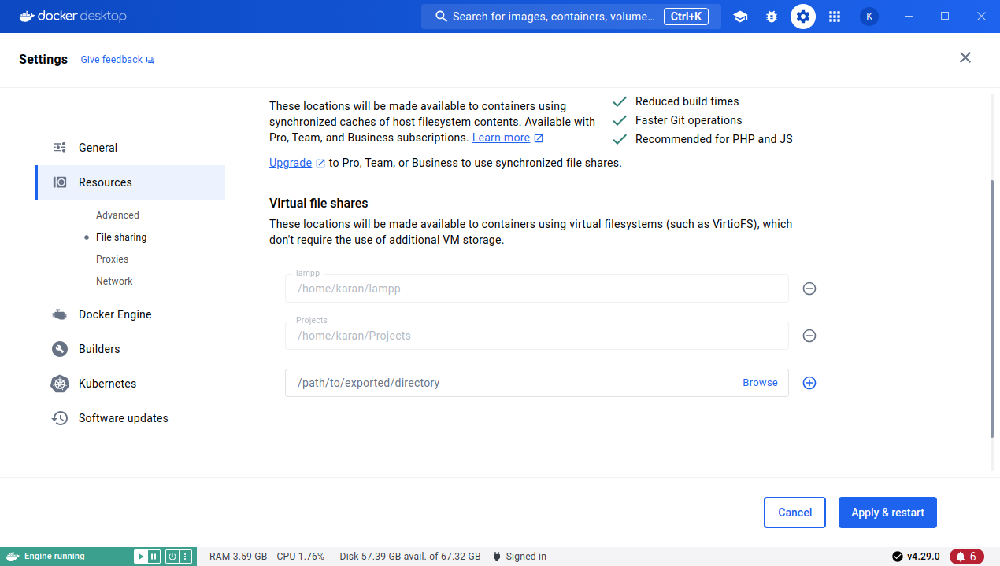

# LAMPP Stack - Docker Compose

Lampp stack made up with docker-compose

### Things to Do

- [ ] PHPMyAdmin - Auto Configuration
- [ ] Slim Docker Containers
- [ ] Auto Discovery Selected Folder for Sites 
- [ ] Auto SSL sites
- [ ] PHP Version Selector

### Usage 
 - `./setup.sh build-start` - For Building Images and Start Docker
 - `./setup.sh start` - For starting docker images
 - `./setup.sh stop` - For stopping docker images
 - `./setup.sh destroy` - Removing all images and data

 ### Instruction 
 This project is created to handle the web development tasks on local.

 

 
